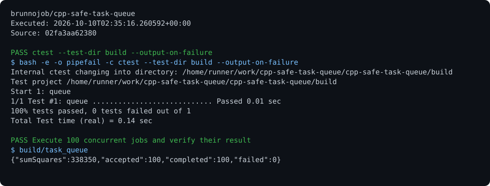

# Safe Task Queue

A concurrent executor with bounded queue capacity, priorities, task-start deadlines, futures, and shutdown that drains or cancels queued tasks.

## Run

Requirements: C++20 and CMake.

```sh
cmake -S . -B build
cmake --build build
ctest --test-dir build --output-on-failure
build/task_queue > result.json
```

## Behavior

The reusable implementation is in `include/task_queue.hpp`. Tests cover 1,000 concurrent tasks, exceptions, deadlines, and rejection after shutdown. A deadline is checked before a task starts; it does not interrupt a running task.

## Optional report archive

Use the [native C operations archive client](https://github.com/brunnojob/vercel-home-telemetry-api/tree/main/clients/c) to queue `result.json` under project `cpp-safe-task-queue`. The client uses `BRUNNODEV_ACCESS_TOKEN` and retains unacknowledged reports locally.

## License

Original source and documentation are MIT licensed; see [LICENSE](LICENSE). Third-party dependencies and media retain their respective terms. Maintained by [Brunno Dev](https://brunnodev.store).

## Implementation update

Concurrent shutdown calls are serialized. Workers cannot initiate a shutdown that would join their own thread. Native regression checks cover worker rejection, concurrent shutdown and completed-task metrics.

Contribution trailer: `Co-authored-by: nyctophile <33561761+ineedfoundmyway@users.noreply.github.com>`.

## Execution proof

[](https://github.com/brunnojob/cpp-safe-task-queue/actions/workflows/proof.yml)



[Verified run](https://github.com/brunnojob/cpp-safe-task-queue/actions/runs/38017989473) · [Execution report](docs/proof/evidence.json)

Run `python .proof/record.py` after installing the prerequisites above. The scenarios execute repository code and verify exit codes and expected output. CI publishes `execution-proof` with the transcript, input fingerprints and source commit. The downloadable report identifies the exact tested version; the workflow badge tracks the latest run.
